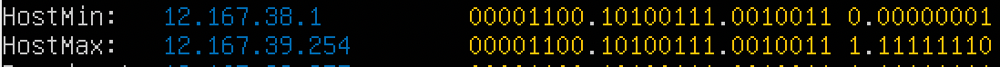

# Сети в Linux

Настройка сетей в Linux на виртуальных машинах.

## Contents
1 [Инструмент ipcalc](#part-1-инструмент-ipcalc) \
2 [Статическая маршрутизация между двумя машинами](#part-2-статическая-маршрутизация-между-двумя-машинами) \
3 [Утилита iperf3](#part-3-утилита-iperf3) \
4 [Сетевой экран](#part-4-сетевой-экран) \
5 [Статическая маршрутизация сети](#part-5-статическая-маршрутизация-сети) \
6 [Динамическая настройка IP с помощью DHCP](#part-6-динамическая-настройка-ip-с-помощью-dhcp) \
7 [NAT](#part-7-nat) \
8 [Допополнительно. Знакомство с SSH Tunnels](#part-8-дополнительно-знакомство-с-ssh-tunnels)

## Part 1. Инструмент **ipcalc**

* Установим утилиту ipcalc на пк
```bash
sudo apt intall ipcalc
```

### Сети и маски
* аддресс сети 192.167.38.54/13

 

* Перфиксана и двоичная запись маски 255.255.255.0


* Двоичная и обчная запись /15
  


* Постфиксная и обычная запись для 11111111.11111111.11111111.11110000


* Мимнимальный и максимальный хочт сети 12.167.38.4 при маске /8
  


* Мимнимальный и максимальный хочт сети 12.167.38.4 при маске 11111111.11111111.00000000.00000000


* Мимнимальный и максимальный хочт сети 12.167.38.4 при маске 255.255.254.0



* Мимнимальный и максимальный хочт сети 12.167.38.4 при маске /4


### Localhost

* К приложению, работающему на localhost можно обратиться с: 127.0.0.2, 127.1.0.1

* Нельзя обратиться с: 194.34.23.100, 128.0.0.1

### Диапазоны и сегменты сетей

* IP адреса, которые можно использовать в качестве частных: 10.0.0.45, 172.20.250.4, 192.168.4.2, 172.16.255.255, 10.10.10.10 - частные. 134.43.0.2, 172.0.2.1, 192.172.0.1, 172.68.0.2, 192.169.168.1 - публичные.
* IP адреса, возможные у сети 10.10.0.0/18: 10.10.0.2, 10.10.10.10, 10.10.1.255 Невозможные: 10.0.0.1, 10.10.100.1

## Part 2. Статическая маршрутизация между двумя машинами

### С помощью команды `ip a` посмотреть существующие сетевые интерфейсы


* Сетевые конфигурации в etc/netplan/00-installer-config.yaml


* Применяем netplan apply


### Добавление статического маршрута вручную

* Применяем ip r add на обоих машинах и пингуем одну и другую


### Добавление статического маршрута с сохранением
* Добавляем маршруты от одной машины до другой с помощью файла etc/netplan/00-installer-config.yaml


* Затем применяем настройки netplan apply и пингуем машины


## Part 3. Утилита **iperf3**

### Скорость соединения
* 8Mbps --> 1MB/s 100MB/s --> 819200Kbps 1Gbps --> 1024Mbps

### 3.2. Утилита **iperf3**
* Запускаем и замеряем скорость


## Part 4. Сетевой экран
### Утилита **iptables**
* Делаем концигурационне файлы для фаервола на двух машинах в */etc/firewall.sh*


* Применяем настройки и пингуем машины


* Правила выполняться сверху-вниз, следовательно, если правило запрета находиться выше оно срабатывает, а правило разрешения находящиеся ниже нет.
### Утилита **nmap**

* Командой ping найти машину, которая не "пингуется", после чего утилитой nmap показать, что хост машины запущен.


## Part 5. Статическая маршрутизация сети
### Настройка адресов машин
* Настроить конфигурации машин в *etc/netplan/00-installer-config.yaml* согласно сети на рисунке.

* Проверяем адреса

* Также пропинговать ws22 с ws21. Аналогично пропинговать r1 с ws11.


### Включение переадресации IP-адресов.
* Для включения переадресации IP, выполните команду на роутерах: `sysctl -w net.ipv4.ip_forward=1`

* Откройте файл */etc/sysctl.conf* и добавьте в него следующую строку: `net.ipv4.ip_forward = 1`


### Установка маршрута по-умолчанию
* Настроить маршрут по-умолчанию (шлюз) для рабочих станций.

* Вызвать `ip r` и показать, что добавился маршрут в таблицу маршрутизации

* Пропинговать с ws11 роутер r2 и показать на r2, что пинг доходит. Для этого использовать команду: `tcpdump -tn -i eth1`


### Добавление статических маршрутов
* Добавить в роутеры r1 и r2 статические маршруты в файле конфигураций. Пример для r1 маршрута в сетку 10.20.0.0/26:

* Вызвать `ip r` и показать таблицы с маршрутами на обоих роутерах.

* Запустить команды на ws11: `ip r list 10.10.0.0/[маска сети]` и `ip r list 0.0.0.0/0`

* Для адреса 10.10.0.0/18 был выбран маршрут отличный от 0.0.0.0/0, потому что роутер всегда предпочитает выбирает ту маску что больше, а также поскольку он является адресом сети и доступен без шлюза.

### Построение списка маршрутизаторов
* Запустить на r1 команду дампа: `tcpdump -tnv -i eth0`
* При помощи утилиты **traceroute** построить список маршрутизаторов на пути от ws11 до ws21

* Путь строиться от узла к узлу до того момента, покаа не будет достигнута конечная точка. Каждый пакет проходит на своем пути определенное количество узлов, пока достигнет своей цели. На каждом узле добавляется счетчик, который отслеживает количество пройденых узлов.

### Использование протокола **ICMP** при маршрутизации
* Запускаем на r1 перехват сетевого трафика, проходящего через enp0s8 с помощью команды tcpdump -tn -i <название интерфейса> и пропингуем с ws11 несуществующий IP 10.30.0.111 с помощью команды:


## Part 6. Динамическая настройка IP с помощью **DHCP**
* Для r2 настроить в файле */etc/dhcp/dhcpd.conf* конфигурацию службы **DHCP**:

* в файле *resolv.conf* прописать `nameserver 8.8.8.8.`

* Перезагрузить службу **DHCP** командой `systemctl restart isc-dhcp-server`. Машину ws21 перезагрузить при помощи `reboot` и через `ip a` показать, что она получила адрес.


* Проверяем что машине ws21 выдали адрес

* Также пропинговать ws22 с ws21.

* Указать MAC адрес у ws11, для этого в *etc/netplan/00-installer-config.yaml* надо добавить строки: `macaddress: 10:10:10:10:10:BA`, `dhcp4: true`

* Для r1 настроить аналогично r2, но сделать выдачу адресов с жесткой привязкой к MAC-адресу (ws11). Провести аналогичные тесты


* Запросить с ws21 обновление ip адреса


* sudo dhclient -r <интерфейс> -- освобождает текущий адрес интерфейса
* sudo dhclient -v (for verbose) <интерфейс> -- освобождает задает новый адрес

## Part 7. **NAT**
* В файле */etc/apache2/ports.conf* на ws22 и r1 изменить строку `Listen 80` на `Listen 0.0.0.0:80`, то есть сделать сервер Apache2 общедоступным

* Запустить веб-сервер Apache командой `service apache2 start` на ws22 и r1

* Добавить в фаервол, созданный по аналогии с фаерволом из Части 4, на r2
* Добавляем фаэрвол со следуюшими правилами:
* Удаление правил в таблице filter - iptables -F
* даление правил в таблице "NAT" - iptables -F -t nat
* Отбрасывать все маршрутизируемые пакеты - iptables --policy FORWARD DROP


* Проверить соединение между ws22 и r1 командой `ping`

* Добавить в файл ещё одно правило:

* Проверить соединение между ws22 и r1 командой `ping`

* Добавить в файл ещё два правила:

* Проверяем


## Part 8. Дополнительно. Знакомство с **SSH Tunnels**
